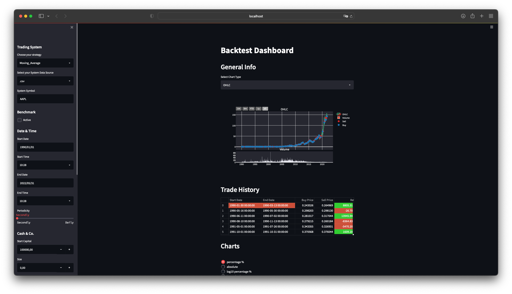

# PyStockSim

PyStockSim is a environment where you can backtest your trading systems. It provides a GUI and performs historical simulation & statistical evaluation of your trading systems. The results are made available to the user through the interface or exported data and consists of:

* Buy-and-Sell Price Chart
* Trade History
* Charts: Equity, Drawdown
* SpreadSheet

 The GUI consists of the sidebar (left) and the main overview (right).
 
 
 ## Usage
 
 ### Prerequisite
 
 Install packages.
 
 ```sh
 $ pip install -r requirements.txt
 ```
 
 ### Start GUI
 
 The PyStockSim GUI uses the streamlit library. To start the GUI you need to run the following commands.
 
 <details><summary><b>Show instructions</b></summary>
 
 1. Start environment:

    ```sh
    $ source venv/bin/activate 
    ```
 
 2. Run streamlit GUI:

    ```sh
    % streamlit run Backtest/main.py
    ```

 ### Create a Backtest
 On the sidebar you set all the necessary parameters to run the backtest for your trading system.
 
 #### Trading System
 
 1. Choose strategy
 2. Select System Data Source
 3. Enter System Symbol or Name of Data Source (.csv)
 4. Activate Benchmark (in progress)
 
 #### Date & Time
 
 1. Enter Date
 2. Enter Start Time (if necessary)
 3. Enter End Date
 4. Enter End Time (if necessary)
 5. Configure the Periodicity (in progress)
 
 #### Cash & Co.
 
 1. Enter Start Capital
 2. Enter Trading Size (if 0 is selected, the complete equity invested for every trade instead of a fix size)
 3. Enter Comission
 4. Enter Risk-Free Rate
 
 #### Optimizer (in progress)
 
 (1. Active Optimizer)
 1. Enter (Start) Parameter (necessary for Moving_Average, 20 is recommended)
 
 ### Confirm Configuration
 
 Confirm your Backtest Configuration and run the Backtest by clicking on the _Run Backtest_-Button
